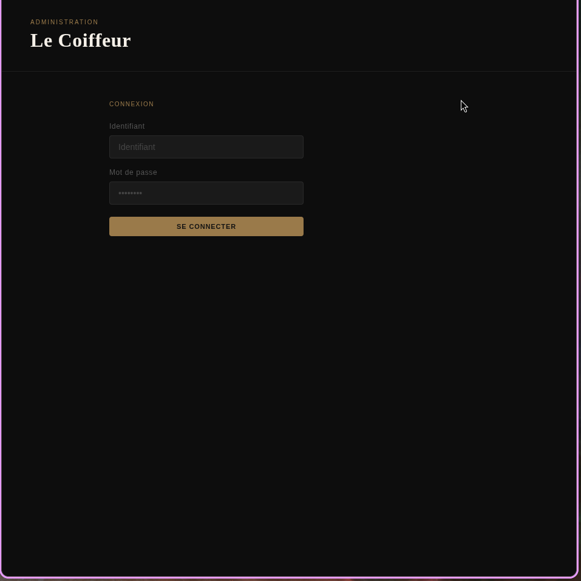
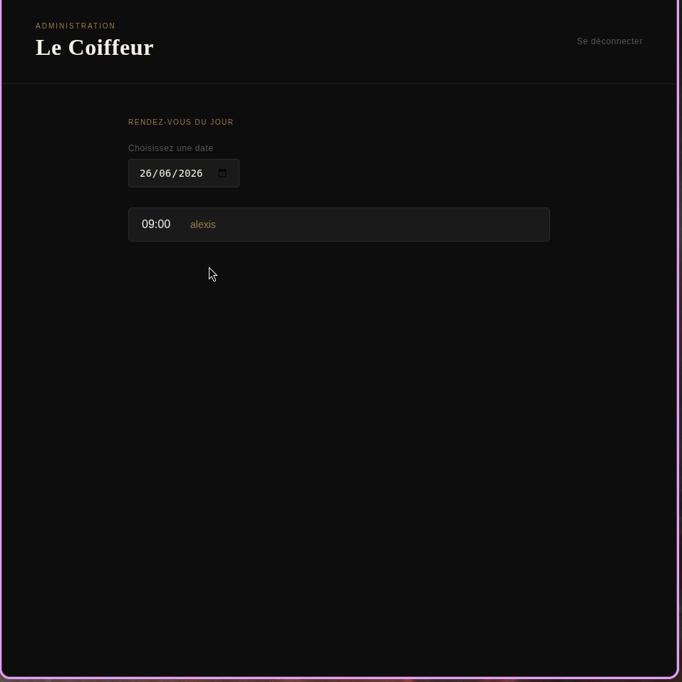
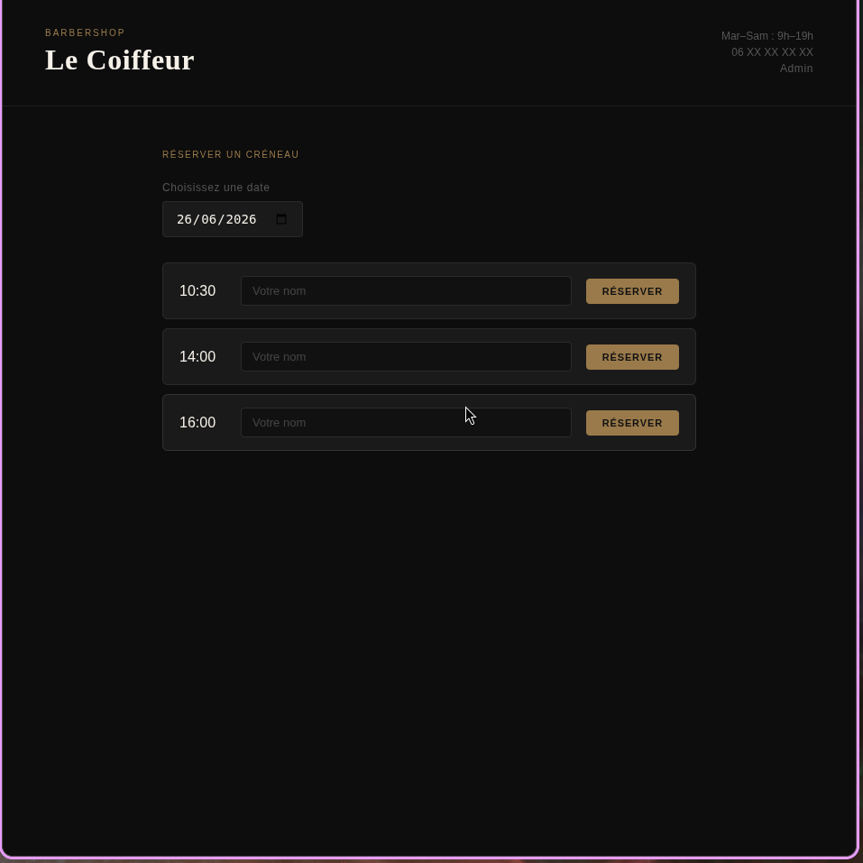

# Just a simple website for a local hairstylist 
It is a simple reservation website that allows customer to book appointment to cut their hair.

# Educational purposes
This is a really simple back-end is written in go and this project is mainly for educational purposes.

# Screenshots

